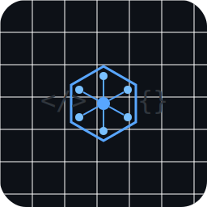

# Gateway MCP Server

<div align="center">
  
</div>

<div align="center">

[](https://github.com/delexw/mcpware/actions/workflows/tests.yml)
[](https://github.com/delexw/mcpware)
[](https://www.python.org/downloads/)
[](https://opensource.org/licenses/MIT)

</div>

Route MCP requests intelligently to multiple backend servers.

## 🎯 Key Features

### 🚀 Bypass Tool Limits
- **Challenge**: MCP clients often have limits on how many tools can be loaded at once
- **Solution**: mcpware exposes only 2 routing tools while providing access to unlimited backend tools
- **Result**: Connect to GitHub (50+ tools), databases, and more through a single gateway!

### 🔧 Additional Benefits
- **Single entry point** for multiple MCP servers
- **Automatic process management** for backend servers
- **Docker-based** isolation and deployment

## Quick Start

```bash
# Clone the repository
git clone https://github.com/delexw/mcpware.git
cd mcpware

# Build the Docker image
docker build -t mcpware . --no-cache

# Configure MCP client (see Installation section)
```

Then configure MCP Clients as shown in the [Installation](#installation) section.

## How it Works

mcpware runs as a Docker container that:
1. Receives requests from MCP clients via stdio
2. Routes them to the appropriate backend MCP server (also running in Docker)
3. Returns responses back to MCP client

**Important**: Backend servers can use any command (`docker`, `npx`, `node`, `python`, etc.). When running mcpware in Docker, backends using local commands like `npx` or `node` will execute inside the mcpware container.

## Installation

### Prerequisites
- Docker
- MCP Clients (Cursor etc..)

### Setup with MCP Client

1. Clone this repository:
   ```bash
   git clone https://github.com/delexw/mcpware.git
   cd mcpware
   ```

2. Configure your backends in `config.json` (see Configuration section below)

3. Set up your environment variables:
   ```bash
   # Create a .env file with your tokens, eg. Github
   echo "GITHUB_PERSONAL_ACCESS_TOKEN=your_token_here" > .env
   ```

4. Add to MCP client configuration:

   **Configuration (Direct Docker Run):**
   ```json
   {
     "mcpServers": {
       "mcpware": {
         "command": "docker",
         "args": [
           "run",
           "-i",
           "--rm",
           "-v",
           "/path/to/mcpware/config.json:/app/config.json:ro",
           "-v",
           "/var/run/docker.sock:/var/run/docker.sock",
           "-e",
           "GITHUB_PERSONAL_ACCESS_TOKEN",
           "mcpware"
         ],
         "env": {
           "GITHUB_PERSONAL_ACCESS_TOKEN": "your_github_token_here"
         }
       }
     }
   }
   ```

   **Important**: 
   - Replace `/path/to/mcpware` with the absolute path to your cloned repository
   - If you configure Github MCP server in config.json, Replace `your_github_token_here` with your actual GitHub Personal Access Token 
   - The Docker socket mount (`/var/run/docker.sock`) is required for mcpware to launch Docker-based backends
   
   **Why mount the Docker socket?**
   - mcpware needs to launch Docker containers for backend MCP servers (like `ghcr.io/github/github-mcp-server`)
   - The Docker socket mount allows mcpware to communicate with Docker
   - Without this mount, mcpware cannot start backend servers that run as Docker containers

### Platform-Specific Docker Socket Configuration

The gateway needs access to the Docker socket to launch backend containers. The mount path differs by platform:

**Why is Docker socket access required?**
mcpware acts as a process manager that launches backend MCP servers. When a backend is configured to run as a Docker container (e.g., `ghcr.io/github/github-mcp-server`), mcpware needs to:
- Create and start Docker containers
- Manage their lifecycle (stop/restart)
- Communicate with them via stdio

Without Docker socket access, mcpware cannot launch Docker-based backends and will fail with permission errors.

#### Quick Check
Run this script to check your Docker configuration:
```bash
python scripts/check_docker_socket.py
```

#### Linux/macOS/WSL2
No changes needed. The default configuration works:
```yaml
volumes:
  - /var/run/docker.sock:/var/run/docker.sock
```

#### Windows (Native Containers)
Update the Docker socket path:
```json
{
  "mcpServers": {
    "mcpware": {
      "command": "docker",
      "args": [
        "run",
        "-i",
        "--rm",
        "-v",
        "/path/to/mcpware/config.json:/app/config.json:ro",
        "-v",
        "//./pipe/docker_engine://./pipe/docker_engine",
        "-e",
        "GITHUB_PERSONAL_ACCESS_TOKEN",
        "mcpware"
      ],
      "env": {
        "GITHUB_PERSONAL_ACCESS_TOKEN": "your_github_token_here"
      }
    }
  }
}
```

Note the different Docker socket path: `//./pipe/docker_engine` instead of `/var/run/docker.sock`

#### Check Your Docker Type
To verify which Docker backend you're using on Windows:
```bash
docker version --format '{{.Server.Os}}'
```
- `linux` = WSL2/Hyper-V backend (use default config)
- `windows` = Windows containers (use override file)

## Configuration

Create a `config.json` with your backend servers:

```json
{
  "backends": {
    "github": {
      "command": "npx",
      "args": ["-y", "@modelcontextprotocol/server-github"],
      "env": {
        "GITHUB_PERSONAL_ACCESS_TOKEN": "${GITHUB_PERSONAL_ACCESS_TOKEN}"
      },
      "description": "GitHub MCP Server",
      "timeout": 60
    },
    "database": {
      "command": "docker",
      "args": ["run", "-i", "--rm", "bytebase/dbhub", "--transport", "stdio"],
      "description": "Database MCP Server"
    }
  }
}
```

**Configuration Notes**:
- Backend commands can be any executable (`docker`, `npx`, `node`, `python`, etc.)
- When using `docker` commands, ensure Docker socket is mounted (see installation instructions)

See `config.example.json` for more backend examples (databases, APIs, etc.).

## Usage

The gateway exposes two main tools:

### use_tool

Routes a tool call to a specific backend server.

Parameters:
- `backend_server`: Name of the backend server
- `server_tool`: Name of the tool to call
- `tool_arguments`: Arguments to pass to the tool

Example:
```json
{
  "backend_server": "github",
  "server_tool": "create_issue",
  "tool_arguments": {
    "owner": "myorg",
    "repo": "myrepo",
    "title": "New issue",
    "body": "Issue description"
  }
}
```

### discover_backend_tools

Discovers available backends and their tools.

Parameters:
- `backend_name`: (Optional) Specific backend to query

## Using mcpware Alongside Other MCP Servers

mcpware is designed to work alongside other MCP servers in your MCP client configuration. You can:

1. **Use mcpware as a gateway** for multiple backend servers
2. **Keep some MCP servers separate** for direct access
3. **Mix and match** based on your needs

Example mixed configuration:
```json
{
  "mcpServers": {
    "mcpware": {
      "command": "docker",
      "args": [
        "run", "-i", "--rm",
        "-v", "/path/to/mcpware/config.json:/app/config.json:ro",
        "-v", "/var/run/docker.sock:/var/run/docker.sock",
        "-e", "GITHUB_PERSONAL_ACCESS_TOKEN",
        "mcpware"
      ],
      "env": {
        "GITHUB_PERSONAL_ACCESS_TOKEN": "your_token"
      }
    },
    "redis-direct": {
      "command": "docker",
      "args": ["run", "--rm", "-i", "-e", "REDIS_HOST=localhost", "mcp/redis"]
    }
  }
}
```

This allows you to:
- Access multiple servers through mcpware when you need routing
- Connect directly to specific servers when you need dedicated access
- Organize your MCP servers based on your workflow

## Development

### Prerequisites

Ensure you have Python 3.10+ installed:
```bash
python --version  # Should show Python 3.10 or higher
```

### Development Setup

1. Clone the repository:
   ```bash
   git clone https://github.com/delexw/mcpware.git
   cd mcpware
   ```

2. Create a virtual environment (recommended):
   ```bash
   python -m venv venv
   source venv/bin/activate  # On Windows: venv\Scripts\activate
   ```

3. Install development dependencies:
   ```bash
   pip install -r requirements.txt
   ```

### Development Dependencies

The project uses minimal dependencies. All core functionality is implemented using the Python standard library.

**Testing dependencies** (included in requirements.txt):
- `pytest` - Testing framework
- `pytest-asyncio` - Async test support
- `pytest-cov` - Code coverage reporting

**Optional development tools** (install separately if needed):
```bash
# Code formatting
pip install black isort

# Linting
pip install flake8 pylint mypy

# Development convenience
pip install pytest-watch  # Auto-run tests on file changes
```

### Running Locally

```bash
# Run the gateway server
python gateway_server.py --config config.json

# Run with debug logging
python gateway_server.py --config config.json --log-level DEBUG
```

### Code Style

Format your code before committing:
```bash
# Format with black (if installed)
black src/ tests/ gateway_server.py

# Sort imports (if installed)
isort src/ tests/ gateway_server.py

# Run linting (if installed)
flake8 src/ tests/ gateway_server.py --max-line-length=120
```

### Running Tests

```bash
# Run all tests
pytest

# Run with coverage report
pytest --cov=src --cov=gateway_server --cov-report=html

# Run specific test file
pytest tests/test_config.py

# Run tests in watch mode (requires pytest-watch)
pytest-watch
```

### Docker

Build and run with Docker:

```bash
# Build the image
docker build -t mcpware .

# Run interactively (for testing)
docker run -it --rm \
  -v $(pwd)/config.json:/app/config.json:ro \
  -v /var/run/docker.sock:/var/run/docker.sock \
  -e GITHUB_PERSONAL_ACCESS_TOKEN \
  mcpware

# Run with specific config file
docker run -it --rm \
  -v /path/to/your/config.json:/app/config.json:ro \
  -v /var/run/docker.sock:/var/run/docker.sock \
  -e GITHUB_PERSONAL_ACCESS_TOKEN \
  mcpware
```

### Environment Variables

The gateway supports environment variable substitution in backend configurations. Set these in your `.env` file:

```bash
# Example .env file
GITHUB_PERSONAL_ACCESS_TOKEN=ghp_xxxxxxxxxxxxx
ANTHROPIC_API_KEY=sk-ant-xxxxxxxxxxxxx
# Add other tokens as needed
```

Environment variables referenced in `config.json` using `${VAR_NAME}` syntax will be automatically substituted.

## Testing

The project includes comprehensive unit and integration tests.

### Running Tests

1. Install test dependencies:
   ```bash
   pip install -r requirements.txt
   ```

2. Run all tests:
   ```bash
   pytest
   ```

3. Run tests with coverage:
   ```bash
   pytest --cov=src --cov=gateway_server --cov-report=html
   ```

4. Run specific test modules:
   ```bash
   pytest tests/test_config.py
   pytest tests/test_backend.py
   pytest tests/test_protocol.py
   ```

5. Run tests in watch mode:
   ```bash
   pytest-watch
   ```

## Security Details

mcpware prevents cross-backend information leakage through multiple layers:

### Attack Prevention Example
1. **Attacker** creates malicious GitHub issue with prompt injection
2. **User** asks: "Review my GitHub issues"  
3. **Agent** reads malicious issue and tries to query database
4. **mcpware blocks**: Cannot send database data back to GitHub (public backend)

### Security Tools
- Use `security_status` tool to monitor session security
- Configure policies in `config.json` (see `config.example.json` for full options)
- Automatic taint tracking after suspicious activity

## Architecture

mcpware uses a "Docker-out-of-Docker" approach:
- Runs as a container with access to host Docker daemon
- Launches backend containers as siblings (not children)
- Backends can access host services via `host.docker.internal`
- Communication via stdio pipes between containers

## License

MIT
